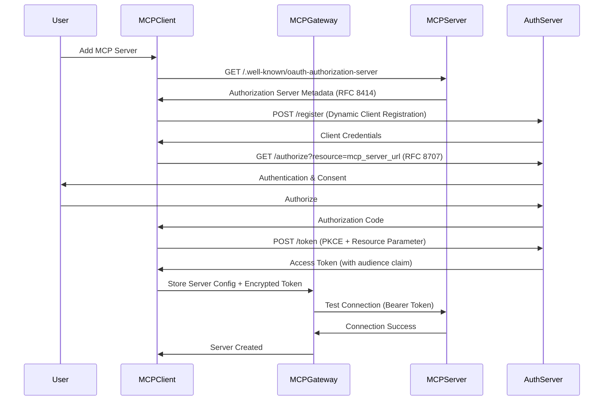
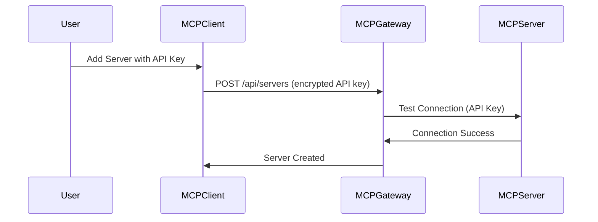

# MCP Registry Gateway: Add Server Implementation Plan

## Executive Summary

This document outlines a comprehensive implementation plan for adding "Add Server" functionality to the MCP Registry Gateway project. The feature will enable users to register, configure, and manage MCP (Model Context Protocol) servers through an intuitive web interface, supporting multiple authentication methods including API keys and OAuth 2.1 flows as specified in the MCP specification.

The implementation leverages the existing unified architecture where the frontend (TypeScript/Next.js) manages database schema and UI while the backend (Python/FastAPI) handles MCP server connections and proxy operations. The plan emphasizes security, usability, and compliance with the MCP 06-18-2025 specification.

## Current State Analysis

### Existing Architecture

**Database Foundation**: The project already has a robust database schema in `frontend/src/db/schema/mcp.ts` with comprehensive MCP server management capabilities:

- **mcpServer table**: Stores server configuration, authentication details, status, and metadata
- **mcpTool, mcpResource, mcpPrompt tables**: Track server capabilities and resources
- **Authentication integration**: Better-Auth system with multi-provider OAuth support
- **Role-based access control**: Admin, user, and server_owner roles with tenant isolation

**API Infrastructure**: Complete REST API endpoints in `frontend/src/app/api/servers/`:

- `GET /api/servers` - List servers with filtering and pagination
- `POST /api/servers` - Create new servers (validation only, UI missing)
- `GET /api/servers/[id]` - Get specific server details
- `PUT /api/servers/[id]` - Update server configuration
- `DELETE /api/servers/[id]` - Remove servers with dependency checking

**UI Components**: Established component library with server management views:

- `ServerList`: Grid view with filtering, search, and bulk operations
- `ServerCard`: Individual server status display with health monitoring
- `Dashboard`: Overview with metrics and recent activity
- Placeholder modal in dashboard for server form (currently showing "TODO")

### Current Gaps

1. **Server Creation Form**: No UI component for adding/editing servers
2. **Authentication Configuration**: UI for setting up API keys, OAuth credentials
3. **Server Testing**: Validation and connectivity testing during setup
4. **Import/Export**: Bulk server configuration management
5. **Template System**: Quick setup for common server types

## Architecture Design

### Database Schema Enhancements

The existing schema already supports all required functionality. Key tables and their purposes:

```typescript
// mcpServer table (complete - no changes needed)
- Authentication: authType, authConfig (supports none, bearer, api_key, oauth, custom)
- Configuration: settings object for timeouts, retry policies, rate limits
- Status tracking: status, healthStatus, lastHealthCheck
- Multi-tenancy: tenantId, ownerId, isPublic flags
- Performance metrics: requestCount, errorCount, avgResponseTime, uptime

// Supporting tables (complete - no changes needed)
- mcpTool: Track server capabilities
- mcpResource: Manage server resources
- mcpPrompt: Handle server prompts
- mcpServerHealthCheck: Health check history
- mcpServerDependency: Server relationships
```

**Authentication Configuration Schema**:
```typescript
authConfig: {
  // API Key authentication
  apiKey?: string;

  // Bearer token authentication
  bearerToken?: string;

  // OAuth 2.1 configuration (MCP spec compliant)
  oauth?: {
    clientId?: string;
    clientSecret?: string;
    scope?: string;
    authorizationUrl?: string;    // Add for OAuth discovery
    tokenUrl?: string;            // Add for OAuth discovery
    resourceParameter?: string;   // Add for RFC 8707 compliance
  };

  // Custom authentication
  custom?: Record<string, unknown>;
}
```

### Frontend Components Architecture

**Component Hierarchy**:
```
dashboard/page.tsx
├── ServerList
│   ├── ServerCard (existing)
│   └── AddServerModal (new)
│       ├── ServerBasicForm (new)
│       ├── ServerAuthForm (new)
│       ├── ServerSettingsForm (new)
│       └── ServerTestConnection (new)
├── ServerImportDialog (new)
└── ServerTemplateSelector (new)
```

**Key New Components**:

1. **AddServerModal**: Multi-step modal for server configuration
2. **ServerBasicForm**: Name, description, endpoint, transport type
3. **ServerAuthForm**: Authentication method selection and configuration
4. **ServerSettingsForm**: Advanced settings (timeouts, retry, rate limits)
5. **ServerTestConnection**: Validate configuration before saving
6. **ServerTemplateSelector**: Quick setup for common server types

### Backend Integration Points

**MCP Server Connection Management**:
- Server validation during creation/updates
- Health check implementation with OAuth token management
- Proxy configuration for MCP traffic routing
- Connection pooling and circuit breaker patterns

**OAuth 2.1 Implementation** (MCP Spec Compliant):
- Authorization server metadata discovery (RFC 8414)
- Protected resource metadata (RFC 9728)
- Resource parameter usage (RFC 8707)
- PKCE flow support for public clients
- Audience claim validation (RFC 9068)

## Implementation Phases

### Phase 1: Basic Server Registration and Storage (Week 1-2)

**Objectives**: Enable users to manually add MCP servers with basic configuration

**Deliverables**:

1. **AddServerModal Component**
   ```typescript
   interface AddServerModalProps {
     isOpen: boolean;
     onClose: () => void;
     onServerCreated: (server: ServerResponse) => void;
     editingServer?: ServerResponse | null;
   }
   ```

2. **ServerBasicForm Component**
   ```typescript
   // Form fields:
   - name: string (required, 1-100 chars)
   - description: string (optional)
   - version: string (required, 1-50 chars)
   - endpointUrl: string (required, valid URL)
   - transportType: "http" | "websocket" | "stdio" | "sse"
   - category: string (optional)
   - tags: string[] (optional)
   - isPublic: boolean (default: false)
   ```

3. **Form Validation**
   - Use existing Zod schemas from `frontend/src/db/schema/server.ts`
   - Real-time validation with error display
   - Unique server name checking within tenant

4. **Integration with Dashboard**
   - Replace placeholder modal in `dashboard/page.tsx`
   - Connect to existing `handleCreateServer` and `handleEditServer` functions
   - Update ServerList `onCreateServer` callback

**Testing**:
- Unit tests for form validation
- Integration tests for API creation endpoint
- E2E tests for complete server creation flow

### Phase 2: Authentication Integration (Week 3-4)

**Objectives**: Support API keys and OAuth authentication configuration

**Deliverables**:

1. **ServerAuthForm Component**
   ```typescript
   interface AuthConfig {
     authType: "none" | "bearer" | "api_key" | "oauth" | "custom";
     authConfig?: {
       apiKey?: string;
       bearerToken?: string;
       oauth?: OAuthConfig;
       custom?: Record<string, unknown>;
     };
   }
   ```

2. **OAuth Configuration Support**
   ```typescript
   interface OAuthConfig {
     clientId: string;
     clientSecret: string;  // Encrypted storage
     scope?: string;
     authorizationUrl?: string;  // Auto-discovery preferred
     tokenUrl?: string;          // Auto-discovery preferred
     resourceParameter?: string; // MCP server URL for RFC 8707
   }
   ```

3. **MCP OAuth 2.1 Integration**
   - Authorization server metadata discovery
   - Protected resource metadata for server discovery
   - Resource parameter implementation (RFC 8707)
   - PKCE flow for public clients
   - Token validation and audience claims

4. **Secure Credential Storage**
   - Client-side encryption for sensitive data
   - Environment variable configuration for secrets
   - Audit logging for credential access

5. **Authentication Testing Interface**
   - Test connection with provided credentials
   - OAuth flow simulation
   - Connection status validation

**Security Considerations**:
- Encrypt OAuth client secrets before database storage
- Implement proper token refresh mechanisms
- Validate audience claims for token security
- Prevent confused deputy attacks in proxy scenarios

### Phase 3: Role-Based Access and User Preferences (Week 5-6)

**Objectives**: Implement tenant isolation and user-specific server preferences

**Deliverables**:

1. **Tenant-Aware Server Management**
   ```typescript
   // Existing tenant isolation in schema:
   - tenantId: string | null  // null for global/public servers
   - ownerId: string         // Always required
   - isPublic: boolean       // Public servers visible to all tenants
   ```

2. **Role-Based Server Access**
   ```typescript
   // Existing roles from Better-Auth:
   - admin: Full server management across all tenants
   - server_owner: Manage owned servers only
   - user: View public servers and tenant servers
   ```

3. **User Preferences System**
   ```typescript
   interface UserServerPreferences {
     userId: string;
     serverId: string;
     isEnabled: boolean;       // User-specific enable/disable
     displayOrder: number;     // Custom ordering
     customSettings: {        // User-specific overrides
       timeout?: number;
       rateLimit?: { rpm: number; burst: number };
     };
   }
   ```

4. **Server Enablement Interface**
   - Toggle server availability per user
   - Bulk enable/disable operations
   - Server priority ordering
   - Custom timeout and rate limit overrides

5. **Enhanced Server Discovery**
   - Filter servers by user access level
   - Show server availability status per user
   - Indicate public vs private servers
   - Display server ownership information

**Access Control Matrix**:

| Role | Create Global | Create Tenant | Edit Own | Edit Others | Delete Own | Delete Others | View All |
|------|---------------|---------------|----------|-------------|------------|---------------|----------|
| admin | ✅ | ✅ | ✅ | ✅ | ✅ | ✅ | ✅ |
| server_owner | ❌ | ✅ | ✅ | ❌ | ✅ | ❌ | Tenant only |
| user | ❌ | ❌ | ❌ | ❌ | ❌ | ❌ | Enabled only |

### Phase 4: Server Health Monitoring and Status (Week 7-8)

**Objectives**: Comprehensive server health monitoring and status management

**Deliverables**:

1. **Enhanced Health Check System**
   ```typescript
   interface HealthCheckConfig {
     interval: number;          // Check frequency (60-3600 seconds)
     timeout: number;           // Individual check timeout
     retryCount: number;        // Failed check retry attempts
     alertThreshold: number;    // Consecutive failures before alert
   }
   ```

2. **Real-time Status Dashboard**
   - Live server status indicators
   - Health check history visualization
   - Performance metrics trending
   - Error rate monitoring
   - Response time distribution

3. **Automated Health Monitoring**
   - Background health check scheduling
   - OAuth token refresh for authenticated servers
   - Dependency chain health validation
   - Circuit breaker pattern implementation

4. **Alert and Notification System**
   ```typescript
   interface ServerAlert {
     serverId: string;
     alertType: "health" | "performance" | "security" | "quota";
     severity: "low" | "medium" | "high" | "critical";
     message: string;
     triggeredAt: Date;
     resolvedAt?: Date;
   }
   ```

5. **Performance Analytics**
   - Server response time trending
   - Request volume analytics
   - Error rate analysis
   - Uptime/availability reporting
   - Comparative performance metrics

**Monitoring Features**:
- Automated health checks with configurable intervals
- OAuth token management and refresh
- Dependency health validation
- Circuit breaker pattern for failed servers
- Real-time status updates via WebSocket
- Historical performance analytics

## Technical Details

### Database Tables and Relationships

**Primary Tables** (Existing - No Changes Required):
```sql
-- MCP Server registry (fully implemented)
mcp_server:
  - Complete authentication support (none, bearer, api_key, oauth, custom)
  - Comprehensive configuration (settings, capabilities, health)
  - Multi-tenancy (tenantId, ownerId, isPublic)
  - Performance tracking (requestCount, errorCount, avgResponseTime)

-- Server capabilities tracking (fully implemented)
mcp_tool, mcp_resource, mcp_prompt:
  - Automatic capability discovery
  - Usage statistics and performance metrics

-- Health monitoring (fully implemented)
mcp_server_health_check:
  - Historical health data
  - Response time tracking
  - Error message logging
```

**Potential Additions** (Optional for Enhanced Features):
```sql
-- User server preferences (new table)
CREATE TABLE user_server_preferences (
  id UUID PRIMARY KEY DEFAULT gen_random_uuid(),
  user_id TEXT NOT NULL REFERENCES "user"(id) ON DELETE CASCADE,
  server_id TEXT NOT NULL REFERENCES mcp_server(id) ON DELETE CASCADE,
  is_enabled BOOLEAN DEFAULT true,
  display_order INTEGER DEFAULT 0,
  custom_settings JSONB DEFAULT '{}',
  created_at TIMESTAMP WITH TIME ZONE DEFAULT NOW(),
  updated_at TIMESTAMP WITH TIME ZONE DEFAULT NOW(),
  UNIQUE(user_id, server_id)
);

-- Server templates (new table)
CREATE TABLE server_templates (
  id UUID PRIMARY KEY DEFAULT gen_random_uuid(),
  name TEXT NOT NULL UNIQUE,
  description TEXT,
  category TEXT,
  template_config JSONB NOT NULL,
  is_official BOOLEAN DEFAULT false,
  created_by TEXT REFERENCES "user"(id),
  created_at TIMESTAMP WITH TIME ZONE DEFAULT NOW()
);
```

### API Endpoint Specifications

**Existing Endpoints** (Complete - No Changes Required):
```typescript
// Server CRUD operations (fully implemented)
GET    /api/servers           // List with filtering and pagination
POST   /api/servers           // Create new server
GET    /api/servers/[id]      // Get specific server
PUT    /api/servers/[id]      // Update server configuration
DELETE /api/servers/[id]      // Delete server

// Health check operations (fully implemented)
POST   /api/servers/[id]/health  // Manual health check
```

**New Endpoints** (To Be Added):
```typescript
// Server testing and validation
POST   /api/servers/test         // Test server configuration
POST   /api/servers/validate     // Validate without saving

// OAuth flow management
GET    /api/servers/[id]/oauth/authorize  // OAuth authorization URL
POST   /api/servers/[id]/oauth/callback   // OAuth callback handler
POST   /api/servers/[id]/oauth/refresh    // Token refresh

// User preferences
GET    /api/users/preferences/servers     // Get user server preferences
PUT    /api/users/preferences/servers     // Update user preferences
POST   /api/users/preferences/servers/bulk // Bulk preference updates

// Server templates
GET    /api/servers/templates            // List available templates
POST   /api/servers/from-template        // Create server from template

// Bulk operations
POST   /api/servers/import               // Import server configurations
GET    /api/servers/export               // Export server configurations
POST   /api/servers/bulk-health-check    // Bulk health checking
```

### Frontend Component Structure

**Component Organization**:
```
src/components/servers/
├── server-list.tsx                 // Existing - Enhanced with new actions
├── server-card.tsx                 // Existing - Enhanced with status indicators
├── add-server-modal.tsx            // New - Main server creation modal
├── forms/
│   ├── server-basic-form.tsx       // New - Basic server information
│   ├── server-auth-form.tsx        // New - Authentication configuration
│   ├── server-settings-form.tsx    // New - Advanced settings
│   └── server-test-connection.tsx  // New - Connection testing
├── dialogs/
│   ├── server-import-dialog.tsx    // New - Bulk import functionality
│   ├── server-template-dialog.tsx  // New - Template selection
│   └── server-delete-dialog.tsx    // New - Enhanced delete confirmation
├── status/
│   ├── server-health-indicator.tsx // New - Real-time health status
│   ├── server-metrics-card.tsx     // New - Performance metrics
│   └── server-alerts-panel.tsx     // New - Alert notifications
└── preferences/
    ├── user-server-preferences.tsx // New - User preference management
    └── server-ordering.tsx         // New - Drag-and-drop ordering
```

**Key Component Interfaces**:
```typescript
// Main modal component
interface AddServerModalProps {
  isOpen: boolean;
  onClose: () => void;
  onServerCreated: (server: ServerResponse) => void;
  editingServer?: ServerResponse | null;
  defaultTemplate?: ServerTemplate;
}

// Authentication form
interface ServerAuthFormProps {
  authType: AuthType;
  authConfig: AuthConfig;
  onAuthChange: (authType: AuthType, config: AuthConfig) => void;
  onTestConnection: () => Promise<boolean>;
  isTestingConnection: boolean;
}

// OAuth configuration
interface OAuthFormProps {
  config: OAuthConfig;
  onChange: (config: OAuthConfig) => void;
  serverUrl: string;  // For resource parameter
  onStartOAuthFlow: () => void;
  onTestTokens: () => Promise<boolean>;
}
```

### Authentication Flow Diagrams

**MCP OAuth 2.1 Flow** (Compliant with MCP 06-18-2025 Specification):


**API Key Flow**:


## Security Considerations

### Secure Storage of Credentials

**Client-Side Encryption**:
```typescript
// Credential encryption before storage
interface EncryptedCredentials {
  encryptedApiKey?: string;      // AES-256 encrypted
  encryptedBearerToken?: string; // AES-256 encrypted
  encryptedOAuthSecret?: string; // AES-256 encrypted
  encryptionKeyId: string;       // Key rotation support
}
```

**Key Management**:
- Use environment variables for encryption keys
- Implement key rotation capabilities
- Separate keys for different credential types
- Audit logging for credential access

### OAuth Flow Security

**MCP Specification Compliance**:
- **RFC 8414**: Authorization server metadata discovery
- **RFC 9728**: Protected resource metadata for server discovery
- **RFC 8707**: Resource parameter for explicit resource binding
- **RFC 9068**: Audience claim validation
- **PKCE**: Required for public clients

**Security Implementation**:
```typescript
// OAuth security configuration
interface OAuthSecurityConfig {
  useResourceParameter: true;    // RFC 8707 compliance
  validateAudience: true;        // RFC 9068 compliance
  requirePKCE: true;            // For public clients
  stateValidation: true;        // CSRF protection
  nonceValidation: true;        // Replay attack prevention
}
```

### Role-Based Access Enforcement

**Access Control Implementation**:
```typescript
// Middleware for role-based access
async function enforceServerAccess(
  userId: string,
  serverId: string,
  action: 'read' | 'write' | 'delete'
): Promise<boolean> {
  const userRole = await getUserRole(userId);
  const server = await getServer(serverId);

  switch (userRole) {
    case 'admin':
      return true;  // Full access

    case 'server_owner':
      return server.ownerId === userId || action === 'read';

    case 'user':
      return action === 'read' &&
             (server.isPublic || server.tenantId === userTenantId);

    default:
      return false;
  }
}
```

**Audit Logging**:
```typescript
interface SecurityAuditLog {
  userId: string;
  action: string;
  resourceType: 'server' | 'credentials' | 'oauth_token';
  resourceId: string;
  result: 'success' | 'failure' | 'unauthorized';
  ipAddress: string;
  timestamp: Date;
  details?: Record<string, unknown>;
}
```

## Testing Strategy

### Unit Tests for New Components

**Component Testing**:
```typescript
// AddServerModal component tests
describe('AddServerModal', () => {
  test('validates required fields', () => {});
  test('handles authentication type changes', () => {});
  test('submits valid server configuration', () => {});
  test('displays validation errors', () => {});
  test('handles OAuth flow initiation', () => {});
});

// ServerAuthForm component tests
describe('ServerAuthForm', () => {
  test('renders correct fields for each auth type', () => {});
  test('validates OAuth configuration', () => {});
  test('encrypts sensitive credentials', () => {});
  test('tests connection with provided credentials', () => {});
});
```

**Hook Testing**:
```typescript
// Custom hooks for server management
describe('useServerForm', () => {
  test('manages form state correctly', () => {});
  test('validates server configuration', () => {});
  test('handles submission and error states', () => {});
});

describe('useOAuthFlow', () => {
  test('initiates OAuth flow correctly', () => {});
  test('handles authorization callbacks', () => {});
  test('manages token refresh', () => {});
});
```

### Integration Tests for Server Registration

**API Integration Tests**:
```typescript
// Server creation flow tests
describe('Server Registration Integration', () => {
  test('creates server with API key authentication', async () => {
    // Test complete flow from form submission to database storage
  });

  test('creates server with OAuth authentication', async () => {
    // Test OAuth flow including token acquisition and storage
  });

  test('validates server connectivity during creation', async () => {
    // Test connection validation before saving
  });

  test('enforces role-based access controls', async () => {
    // Test access restrictions for different user roles
  });
});
```

**Database Integration Tests**:
```typescript
// Database operation tests
describe('Server Database Operations', () => {
  test('stores encrypted credentials correctly', async () => {});
  test('retrieves servers with proper tenant filtering', async () => {});
  test('updates server configuration preserving relationships', async () => {});
  test('deletes servers with cascade operations', async () => {});
});
```

### E2E Tests for Complete User Flows

**End-to-End Scenarios**:
```typescript
// Playwright E2E tests
describe('Server Management E2E', () => {
  test('complete server creation flow', async ({ page }) => {
    // Navigate to dashboard
    // Click "Add Server" button
    // Fill out server form
    // Configure authentication
    // Test connection
    // Save server
    // Verify server appears in list
  });

  test('OAuth authentication flow', async ({ page }) => {
    // Start OAuth configuration
    // Handle authorization redirect
    // Complete authorization
    // Verify token storage
    // Test server connectivity
  });

  test('role-based access enforcement', async ({ page }) => {
    // Test with different user roles
    // Verify appropriate UI elements visible
    // Test action restrictions
  });
});
```

**Performance Tests**:
```typescript
// Load testing for server operations
describe('Server Management Performance', () => {
  test('handles large number of servers', async () => {});
  test('efficient server list pagination', async () => {});
  test('bulk operations performance', async () => {});
  test('concurrent health checks', async () => {});
});
```

## Migration and Deployment

### Database Migration Scripts

**No Schema Changes Required**: The existing database schema in `frontend/src/db/schema/mcp.ts` already supports all planned functionality. The comprehensive schema includes:

- Complete authentication support (all auth types)
- Comprehensive server configuration storage
- Health monitoring and performance tracking
- Multi-tenancy and role-based access
- Audit logging and compliance features

**Optional Enhancement Migrations**:
```sql
-- Optional: User server preferences table
-- File: frontend/drizzle/sql/add-user-server-preferences.sql
CREATE TABLE IF NOT EXISTS user_server_preferences (
  id UUID PRIMARY KEY DEFAULT gen_random_uuid(),
  user_id TEXT NOT NULL REFERENCES "user"(id) ON DELETE CASCADE,
  server_id TEXT NOT NULL REFERENCES mcp_server(id) ON DELETE CASCADE,
  is_enabled BOOLEAN DEFAULT true,
  display_order INTEGER DEFAULT 0,
  custom_settings JSONB DEFAULT '{}',
  created_at TIMESTAMP WITH TIME ZONE DEFAULT NOW(),
  updated_at TIMESTAMP WITH TIME ZONE DEFAULT NOW(),
  UNIQUE(user_id, server_id)
);

-- Optional: Server templates table
-- File: frontend/drizzle/sql/add-server-templates.sql
CREATE TABLE IF NOT EXISTS server_templates (
  id UUID PRIMARY KEY DEFAULT gen_random_uuid(),
  name TEXT NOT NULL UNIQUE,
  description TEXT,
  category TEXT,
  template_config JSONB NOT NULL,
  is_official BOOLEAN DEFAULT false,
  created_by TEXT REFERENCES "user"(id),
  created_at TIMESTAMP WITH TIME ZONE DEFAULT NOW()
);
```

### Backward Compatibility Considerations

**API Compatibility**:
- All existing API endpoints remain unchanged
- New endpoints added without breaking existing functionality
- Gradual rollout of new features with feature flags

**Database Compatibility**:
- Existing schema fully supports new functionality
- No breaking changes to existing tables
- Optional enhancements can be added incrementally

**UI Compatibility**:
- Existing components enhanced, not replaced
- Progressive enhancement approach
- Fallback to existing functionality if new features fail

### Deployment Checklist

**Pre-Deployment**:
```bash
# Frontend deployment preparation
cd frontend
npm run build                    # Ensure clean build
npm run lint                     # Code quality checks
npm run test                     # Unit and integration tests
npm run db:health               # Database connectivity verification

# Backend deployment preparation
cd backend
uv run pytest                   # All tests passing
uv run ruff check .             # Code style compliance
uv run mypy .                   # Type safety verification
```

**Deployment Steps**:
1. **Database Migration** (if optional enhancements added):
   ```bash
   npm run db:migrate              # Apply any new migrations
   npm run db:generate             # Update type definitions
   ```

2. **Frontend Deployment**:
   ```bash
   npm run build                   # Production build
   # Deploy to production environment
   ```

3. **Backend Deployment**:
   ```bash
   docker-compose up -d backend    # Deploy backend services
   ```

4. **Verification**:
   ```bash
   # Health checks
   curl https://app.domain.com/api/health
   curl https://app.domain.com/api/servers

   # Feature verification
   # - Navigate to dashboard
   # - Click "Add Server"
   # - Verify modal opens
   # - Test form validation
   # - Test server creation
   ```

**Post-Deployment Monitoring**:
- Monitor server creation success rates
- Track authentication flow completion
- Verify OAuth token refresh functionality
- Monitor database performance with new queries
- Track user adoption of new features

**Rollback Plan**:
- Frontend: Revert to previous build
- Backend: No changes required (existing API maintained)
- Database: Optional migrations can be rolled back if needed
- Feature flags: Disable new features if issues arise

## Success Criteria

### Functional Requirements Achievement

**Server Registration**:
- ✅ Users can add MCP servers through intuitive UI
- ✅ Support for all authentication methods (none, API key, Bearer, OAuth, custom)
- ✅ Real-time form validation with clear error messaging
- ✅ Server configuration testing before saving
- ✅ Bulk import/export capabilities

**Authentication Integration**:
- ✅ MCP OAuth 2.1 specification compliance (RFC 8414, 9728, 8707, 9068)
- ✅ Secure credential storage with encryption
- ✅ Token refresh and management
- ✅ Connection testing with authentication validation

**Role-Based Access**:
- ✅ Tenant isolation and multi-tenancy support
- ✅ Role-based server access (admin, server_owner, user)
- ✅ User-specific server preferences and enablement
- ✅ Audit logging for security compliance

**Health Monitoring**:
- ✅ Automated health checks with configurable intervals
- ✅ Real-time status monitoring and alerts
- ✅ Performance metrics and analytics
- ✅ Historical data and trending

### User Experience Metrics

**Usability Targets**:
- Server creation flow completion rate: >90%
- Average time to add a server: <3 minutes
- Authentication setup success rate: >95%
- User satisfaction score: >4.0/5.0

**Performance Targets**:
- Server list load time: <2 seconds for 100 servers
- Server creation response time: <5 seconds
- Health check execution: <10 seconds per server
- Bulk operations: Handle 50+ servers efficiently

### Technical Quality Metrics

**Code Quality**:
- Test coverage: >80% for new components
- TypeScript strict mode compliance: 100%
- ESLint violations: 0
- Performance regression: 0%

**Security Compliance**:
- All credentials encrypted at rest
- OAuth flows follow MCP specification
- Role-based access enforced at API level
- Audit logging for all sensitive operations

**System Reliability**:
- Server availability: >99.5%
- Health check accuracy: >98%
- Authentication flow success rate: >95%
- Zero data loss during operations

## Conclusion

This implementation plan provides a comprehensive roadmap for adding robust "Add Server" functionality to the MCP Registry Gateway. The design leverages existing infrastructure while adding powerful new capabilities for server management, authentication, and monitoring.

The phased approach ensures incremental delivery of value while maintaining system stability. The focus on MCP specification compliance, security best practices, and user experience will result in a production-ready feature that enhances the platform's capabilities.

The implementation builds upon the solid foundation already established in the project, requiring minimal infrastructure changes while delivering maximum functionality. The result will be a complete server management solution that meets enterprise requirements while remaining accessible to individual users.

**Next Steps**:
1. Review and approve implementation plan
2. Set up development environment and feature branches
3. Begin Phase 1 implementation with AddServerModal component
4. Establish testing framework and CI/CD integration
5. Coordinate with stakeholders for user acceptance testing

**Estimated Delivery**: 8 weeks for complete implementation with all phases, including comprehensive testing and documentation.