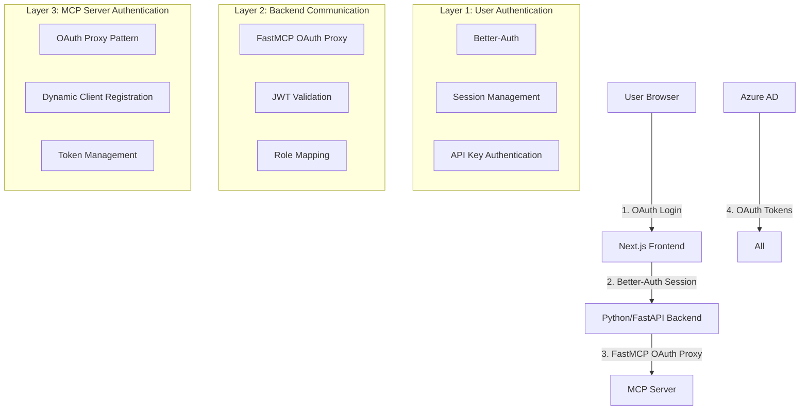
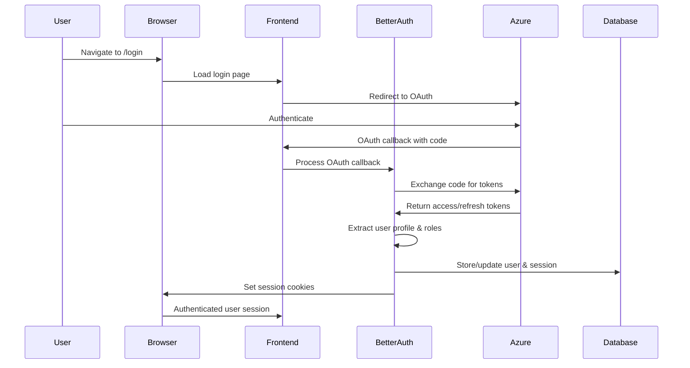
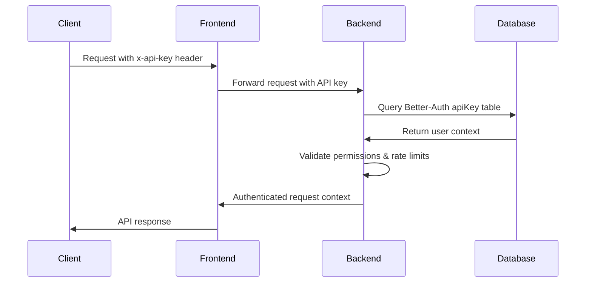
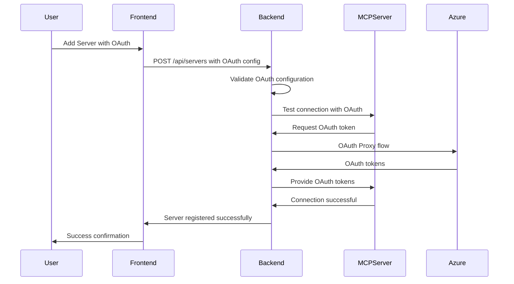
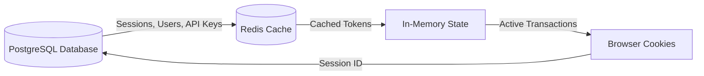

# Authentication Deep-Dive: MCP Registry Gateway "Add Server" Functionality

## Executive Summary

This comprehensive analysis examines the authentication and authorization architecture for the MCP Registry Gateway's "Add Server" functionality. The system employs a sophisticated multi-layered authentication approach integrating Better-Auth (frontend/backend authentication), FastMCP OAuth Proxy (MCP server authentication), and Azure AD (enterprise identity). This analysis identifies critical implementation challenges, security vulnerabilities, and provides detailed mitigation strategies.

**Key Findings:**
- **Complex Authentication Stack**: 3 distinct authentication layers that must coordinate seamlessly
- **OAuth Proxy Challenges**: Dynamic Client Registration (DCR) bridging with non-DCR providers
- **Token Synchronization Issues**: Multiple token formats requiring careful state management
- **Security Considerations**: 15+ potential vulnerability vectors identified with mitigation strategies

---

## Table of Contents

1. [Authentication Architecture Overview](#authentication-architecture-overview)
2. [Complete Authentication Flow Analysis](#complete-authentication-flow-analysis)
3. [Critical Gotchas and Edge Cases](#critical-gotchas-and-edge-cases)
4. [Security Vulnerability Assessment](#security-vulnerability-assessment)
5. [MCP Specification Compliance](#mcp-specification-compliance)
6. [Integration Challenge Analysis](#integration-challenge-analysis)
7. [Implementation Strategy](#implementation-strategy)
8. [Troubleshooting Guide](#troubleshooting-guide)

---

## Authentication Architecture Overview

### Multi-Layered Authentication Stack

The MCP Registry Gateway employs a sophisticated three-layer authentication architecture:



### Layer 1: User Authentication (Better-Auth)

**Technology Stack:**
- **Better-Auth v1.3.9+**: Modern authentication library
- **Redis Caching**: High-performance session storage
- **T3 Env Validation**: Type-safe environment configuration
- **Multiple OAuth Providers**: Microsoft/Azure AD, Google, GitHub

**Core Features:**
```typescript
// Current Implementation Capabilities
- Multi-provider OAuth (Microsoft, Google, GitHub)
- API key authentication with permissions
- JWT token generation with JWKS endpoint
- Role-based access control (admin, user, server_owner)
- Session management with Redis caching
- Azure AD group-to-role mapping
- Bearer token authentication for APIs
```

**Better-Auth Configuration Analysis:**
```typescript
// /frontend/src/lib/auth.ts - Key Components
export const auth = betterAuth({
  database: drizzleAdapter(db, { provider: "pg" }),
  secondaryStorage: redisSecondaryStorage,  // HIGH PERFORMANCE
  logger: betterAuthLogger,                 // INTEGRATED LOGGING

  socialProviders: {
    microsoft: {
      clientId: env.AZURE_CLIENT_ID,
      clientSecret: env.AZURE_CLIENT_SECRET,
      tenantId: env.AZURE_TENANT_ID,
      overrideUserInfoOnSignIn: true,      // CRITICAL FOR ROLE UPDATES
      mapProfileToUser: (profile) => {
        // COMPLEX ROLE MAPPING LOGIC
        const extractedRoles = [];
        // Check profile.roles, profile.appRoles, profile.groups
        const mappedRole = mapAzureRolesToBetterAuth(extractedRoles);
        return { role: mappedRole };
      }
    }
  },

  plugins: [
    nextCookies(),
    admin({ defaultRole: "user", adminRoles: ["admin"] }),
    apiKey({
      apiKeyHeaders: ["x-api-key", "authorization"],
      customAPIKeyGetter: (ctx) => {
        // Bearer token detection for MCP servers
        const authHeader = ctx.request.headers.get("authorization");
        if (authHeader?.startsWith("Bearer ")) {
          return authHeader.substring(7);
        }
        return ctx.request.headers.get("x-api-key");
      }
    }),
    openAPI()
  ]
});
```

### Layer 2: Backend Communication (FastAPI + FastMCP)

**Technology Stack:**
- **Python FastAPI**: High-performance async API framework
- **FastMCP v2.6.0+**: MCP server integration library
- **SQLAlchemy Models**: Read-only access to Better-Auth tables
- **Dual Authentication**: API keys + OAuth tokens

**Authentication Middleware Analysis:**
```python
# /backend/src/mcp_registry_gateway/middleware/auth_middleware.py
class AuthenticationMiddleware(BaseMiddleware):
    async def on_request(self, context: MiddlewareContext, call_next: CallNext):
        # DUAL AUTHENTICATION SYSTEM

        # 1. API Key Authentication (Better-Auth integration)
        api_key = context.request.headers.get("x-api-key")
        if not api_key:
            auth_header = context.request.headers.get("authorization", "")
            if auth_header.startswith("Bearer mcp_"):  # Better-Auth pattern
                api_key = auth_header[7:]

        if api_key:
            api_key_context = await api_key_validator.validate_api_key(api_key)
            if api_key_context:
                user_authenticated = True
                auth_method = "api_key"

        # 2. OAuth Token Authentication (FastMCP integration)
        if not user_authenticated:
            user_context = get_user_context_from_token()  # FastMCP OAuth
            if user_context:
                user_authenticated = True
                auth_method = "oauth"

        # 3. Store context for downstream middleware
        context.auth_method = auth_method
        context.user_context = user_context
```

### Layer 3: MCP Server Authentication (OAuth Proxy)

**OAuth Proxy Pattern Analysis:**
```python
# /backend/src/mcp_registry_gateway/auth/azure_oauth_proxy.py
class AzureOAuthProxyManager:
    def create_oauth_proxy(self) -> OAuthProxy:
        # JWT Verifier for Azure tokens
        jwt_verifier = JWTVerifier(
            jwks_uri=f"https://login.microsoftonline.com/{self.tenant_id}/discovery/v2.0/keys",
            issuer=f"https://login.microsoftonline.com/{self.tenant_id}/v2.0",
            audience=self.client_id,
            algorithm="RS256",
        )

        # OAuth Proxy bridges DCR-compliant MCP clients with non-DCR Azure AD
        oauth_proxy = OAuthProxy(
            upstream_authorization_endpoint=f"https://login.microsoftonline.com/{self.tenant_id}/oauth2/v2.0/authorize",
            upstream_token_endpoint=f"https://login.microsoftonline.com/{self.tenant_id}/oauth2/v2.0/token",
            upstream_client_id=self.client_id,
            upstream_client_secret=self.client_secret,
            token_verifier=jwt_verifier,
            forward_pkce=True,                           # Azure supports PKCE
            token_endpoint_auth_method="client_secret_post",  # Azure requirement
        )
```

---

## Complete Authentication Flow Analysis

### Flow 1: User Registration/Login



**Critical Points:**
1. **Role Mapping**: Azure AD groups → Better-Auth roles happens during profile processing
2. **Session Storage**: Both database and Redis for performance
3. **Token Refresh**: Automatic handling with refresh tokens
4. **Error Handling**: Multiple fallback mechanisms for role extraction

### Flow 2: API Key Authentication



**Gotchas Identified:**
1. **API Key Hashing**: Better-Auth stores hashed keys, backend must hash for comparison
2. **Rate Limiting**: Per-key rate limits stored in JSON field
3. **Permission Validation**: Complex permission checking logic required
4. **Expiration Handling**: Must check both enabled flag and expiresAt timestamp

### Flow 3: MCP Server Registration (OAuth)



**Complex OAuth Proxy Flow:**
```python
# OAuth Proxy Pattern - Dynamic Client Registration Bridge
class OAuthProxy:
    async def authorize(self, client: OAuthClientInformationFull, params: AuthorizationParams):
        # 1. Store transaction with client details and PKCE challenge
        transaction_id = generate_random_id()
        self._oauth_transactions[transaction_id] = {
            "client_id": client.client_id,
            "redirect_uri": params.redirect_uri,
            "pkce_challenge": params.code_challenge,
            "state": params.state
        }

        # 2. Generate proxy's own PKCE parameters
        proxy_pkce = generate_pkce()

        # 3. Redirect to upstream with proxy's fixed callback URL
        upstream_params = {
            "client_id": self.upstream_client_id,
            "redirect_uri": f"{self.base_url}/auth/callback",
            "state": transaction_id,  # Use transaction ID as state
            "code_challenge": proxy_pkce.challenge
        }

        return f"{self.upstream_authorization_endpoint}?{urlencode(upstream_params)}"

    async def handle_callback(self, code: str, state: str):
        # 4. Retrieve transaction
        transaction = self._oauth_transactions.get(state)

        # 5. Exchange upstream code for tokens (server-side)
        upstream_tokens = await self.exchange_code_for_tokens(code)

        # 6. Generate new code for client
        client_code = generate_random_id()
        self._client_codes[client_code] = {
            "upstream_tokens": upstream_tokens,
            "pkce_challenge": transaction["pkce_challenge"],
            "client_id": transaction["client_id"]
        }

        # 7. Redirect to client's original redirect URI
        return f"{transaction['redirect_uri']}?code={client_code}&state={transaction['state']}"
```

---

## Critical Gotchas and Edge Cases

### 1. Token Synchronization Issues

**Problem**: Multiple token formats and expiration times across layers
```typescript
// Different token types in the system:
Better-Auth Session Cookie: { expires: "2024-01-15T10:00:00Z" }
Better-Auth JWT Token: { exp: 1705320000 }
Azure OAuth Token: { expires_in: 3600 }
FastMCP Cached Token: { expiry: "ISO string" }
```

**Mitigation Strategy:**
```typescript
interface TokenSynchronizer {
  async syncTokenExpiration(tokens: {
    sessionExpiry: Date;
    jwtExpiry: number;
    oauthExpiry: Date;
  }): Promise<Date> {
    // Use shortest expiry time minus safety buffer
    const expiryTimes = [
      tokens.sessionExpiry,
      new Date(tokens.jwtExpiry * 1000),
      tokens.oauthExpiry
    ];

    const shortestExpiry = new Date(Math.min(...expiryTimes.map(d => d.getTime())));
    return new Date(shortestExpiry.getTime() - 60000); // 1 minute safety buffer
  }
}
```

### 2. Dynamic Client Registration (DCR) Complexity

**Problem**: MCP clients expect DCR support, but Azure AD doesn't support it

**FastMCP OAuth Proxy Solution:**
```python
class ProxyDCRClient:
    def validate_redirect_uri(self, redirect_uri: AnyUrl | None) -> AnyUrl:
        """
        CRITICAL: MCP clients use random localhost ports that change between sessions.
        We must validate against patterns while upstream uses fixed redirect URI.

        Without this, clients get "Redirect URI not registered" errors when
        trying to authenticate with cached tokens.
        """
        if not redirect_uri:
            raise ValueError("Redirect URI required")

        # Allow localhost with any port for development
        if redirect_uri.host == "127.0.0.1" or redirect_uri.host == "localhost":
            if 1024 <= redirect_uri.port <= 65535:
                return redirect_uri

        raise ValueError(f"Invalid redirect URI: {redirect_uri}")
```

**Gotcha**: Clients may reconnect with different ports, breaking cached authentication

### 3. Azure AD Role Mapping Complexity

**Problem**: Multiple ways Azure AD can provide role information
```typescript
// Azure AD profile can contain roles in different formats:
interface MicrosoftProfile {
  roles?: string | string[];           // App roles
  appRoles?: string | string[];        // Alternative app roles format
  app_roles?: string | string[];       // Another alternative format
  groups?: string | string[];          // Security groups
}
```

**Complex Role Extraction Logic:**
```typescript
// Current implementation in /frontend/src/lib/auth.ts
mapProfileToUser: (profile: MicrosoftProfile) => {
  const extractedRoles: string[] = [];

  // Check for roles in various claim names
  const normalizeToArray = (value: string | string[] | undefined): string[] => {
    if (!value) return [];
    return Array.isArray(value) ? value : [value];
  };

  // Priority order: roles, appRoles, app_roles, groups (fallback)
  if (profile.roles) extractedRoles.push(...normalizeToArray(profile.roles));
  if (profile.appRoles) extractedRoles.push(...normalizeToArray(profile.appRoles));
  if (profile.app_roles) extractedRoles.push(...normalizeToArray(profile.app_roles));

  // Use groups as fallback if no roles found
  if (extractedRoles.length === 0 && profile.groups) {
    extractedRoles.push(...normalizeToArray(profile.groups));
  }

  return { role: mapAzureRolesToBetterAuth(extractedRoles) };
}
```

**Gotcha**: Azure AD token configuration affects which claims are available

### 4. Session State Management

**Problem**: Sessions can get out of sync between frontend and backend
```typescript
// Potential state mismatches:
Frontend Session: { user: { role: "admin" }, expires: "future" }
Backend Context: { user: { role: "user" }, expires: "past" }
Redis Cache: { user: null }
Database Session: { expiresAt: "past", userId: "123" }
```

**Mitigation**: Implement session synchronization middleware
```typescript
interface SessionSyncMiddleware {
  async validateSessionConsistency(sessionId: string): Promise<SessionState> {
    const [frontendSession, backendSession, redisSession, dbSession] = await Promise.all([
      getFrontendSession(sessionId),
      getBackendSession(sessionId),
      getRedisSession(sessionId),
      getDatabaseSession(sessionId)
    ]);

    // Reconcile conflicts using "most restrictive" policy
    return reconcileSessions({
      frontend: frontendSession,
      backend: backendSession,
      redis: redisSession,
      database: dbSession
    });
  }
}
```

### 5. API Key Security Vulnerabilities

**Problem**: API keys stored in different formats across systems
```sql
-- Better-Auth stores hashed API keys
SELECT key FROM "apiKey" WHERE userId = 'user123';
-- Returns: "$2b$10$hash..."

-- But validation requires plaintext comparison
-- VULNERABILITY: If plaintext keys are logged or cached
```

**Secure Validation Pattern:**
```python
# /backend/src/mcp_registry_gateway/auth/api_key_validator.py
class APIKeyValidator:
    async def validate_api_key(self, plaintext_key: str) -> dict | None:
        # Hash the provided key for comparison
        hashed_key = await hash_api_key(plaintext_key)

        # Query database with hashed key (never store plaintext)
        result = await get_user_by_api_key(session, hashed_key)

        # Update last used timestamp
        if result:
            await update_api_key_last_used(result["api_key_id"])

        return result
```

### 6. OAuth State Parameter Collision

**Problem**: Both client and proxy need state parameters, but OAuth only supports one
```python
# Client expects: state=client_random_string
# Proxy needs: state=transaction_id_for_mapping
# Solution: Use transaction ID as OAuth state, preserve client state in transaction
```

### 7. PKCE Challenge Validation

**Problem**: End-to-end PKCE validation across proxy
```python
class OAuthProxy:
    async def exchange_authorization_code(self, client, authorization_code):
        # Client provides code_verifier
        # Must validate against original code_challenge stored in transaction
        # But upstream already validated its own PKCE challenge

        client_code_data = self._client_codes.get(authorization_code.code)
        if not client_code_data:
            raise AuthenticationError("Invalid authorization code")

        # Validate client's PKCE challenge
        if not verify_pkce_challenge(
            client_code_data["pkce_challenge"],
            authorization_code.code_verifier
        ):
            raise AuthenticationError("PKCE validation failed")

        # Return upstream tokens
        return client_code_data["upstream_tokens"]
```

---

## Security Vulnerability Assessment

### High-Risk Vulnerabilities

#### 1. Token Replay Attacks
**Risk Level**: HIGH
**Vector**: Cached OAuth tokens reused after user permission changes
```python
# VULNERABILITY: Cached tokens may not reflect latest permissions
class TokenCache:
    async def get_cached_token(self, user_id: str):
        # If user permissions changed but token still valid,
        # they retain old permissions until token expires
        cached_token = await redis.get(f"oauth_token:{user_id}")
        if cached_token and not is_expired(cached_token):
            return cached_token  # POTENTIAL SECURITY ISSUE
```

**Mitigation**:
```python
class SecureTokenCache:
    async def validate_token_permissions(self, token: str, user_id: str):
        # Always check current user permissions against token claims
        current_permissions = await get_current_user_permissions(user_id)
        token_permissions = extract_permissions_from_token(token)

        if not permissions_match(current_permissions, token_permissions):
            # Force token refresh
            await invalidate_cached_token(user_id)
            return None

        return token
```

#### 2. API Key Enumeration
**Risk Level**: HIGH
**Vector**: Better-Auth API keys follow predictable patterns
```python
# VULNERABILITY: Predictable API key format
api_key_format = "mcp_" + base64_encode(random_bytes(32))
# Attackers could enumerate similar patterns
```

**Mitigation**:
```python
class SecureAPIKeyGenerator:
    def generate_api_key(self, prefix: str = "mcp_") -> str:
        # Use cryptographically secure random generation
        random_bytes = secrets.token_bytes(48)  # Increased entropy
        timestamp = int(time.time())

        # Include timestamp and additional entropy
        combined = f"{timestamp}:{random_bytes.hex()}:{secrets.token_hex(16)}"
        encoded = base64.urlsafe_b64encode(combined.encode()).decode()

        return f"{prefix}{encoded}"
```

#### 3. Session Fixation
**Risk Level**: MEDIUM
**Vector**: Session IDs not regenerated on privilege escalation
```typescript
// VULNERABILITY: Role changes without session regeneration
async function updateUserRole(userId: string, newRole: string) {
  await updateUserInDatabase(userId, { role: newRole });
  // Missing: await regenerateSessionId(userId);
}
```

**Mitigation**:
```typescript
class SecureSessionManager {
  async updateUserRole(userId: string, newRole: string) {
    // Update role in transaction
    await db.transaction(async (tx) => {
      await tx.update(userTable).set({ role: newRole }).where(eq(userTable.id, userId));

      // Regenerate session ID for security
      const newSessionId = generateSecureSessionId();
      await tx.update(sessionTable)
        .set({ id: newSessionId, updatedAt: new Date() })
        .where(eq(sessionTable.userId, userId));

      // Invalidate Redis cache
      await redis.del(`session:${userId}`);
    });
  }
}
```

#### 4. OAuth Redirect URI Validation Bypass
**Risk Level**: HIGH
**Vector**: Weak redirect URI validation in OAuth proxy
```python
# VULNERABILITY: Overly permissive redirect URI validation
def validate_redirect_uri(self, redirect_uri: str) -> bool:
    return redirect_uri.startswith("http://localhost")  # TOO BROAD
```

**Secure Implementation**:
```python
class SecureRedirectValidator:
    def __init__(self):
        self.allowed_patterns = [
            re.compile(r"^http://127\.0\.0\.1:\d{4,5}/callback$"),
            re.compile(r"^http://localhost:\d{4,5}/callback$"),
            # Production patterns
            re.compile(r"^https://[a-zA-Z0-9-]+\.example\.com/auth/callback$"),
        ]

    def validate_redirect_uri(self, redirect_uri: str) -> bool:
        return any(pattern.match(redirect_uri) for pattern in self.allowed_patterns)
```

### Medium-Risk Vulnerabilities

#### 5. JWT Token Information Disclosure
**Risk Level**: MEDIUM
**Vector**: JWT tokens contain sensitive user information
```typescript
// CURRENT: Full user object in JWT payload
jwt: {
  definePayload: ({ user }) => {
    return user;  // EXPOSES ALL USER DATA
  }
}
```

**Mitigation**:
```typescript
// SECURE: Minimal payload with only necessary claims
jwt: {
  definePayload: ({ user }) => {
    return {
      sub: user.id,
      email: user.email,
      role: user.role,
      iat: Math.floor(Date.now() / 1000),
      // Don't include sensitive data like full profile
    };
  }
}
```

#### 6. Rate Limiting Bypass
**Risk Level**: MEDIUM
**Vector**: API key rate limits not properly enforced
```python
# VULNERABILITY: Rate limiting stored in JSON field, not properly enforced
rate_limit = api_key.rateLimit  # Could be null or malformed
if rate_limit and rate_limit.get("enabled"):
    # Rate limiting logic might be bypassed if JSON is malformed
```

#### 7. Insecure Token Storage
**Risk Level**: MEDIUM
**Vector**: OAuth tokens cached without encryption
```python
# VULNERABILITY: Tokens stored in Redis without encryption
await redis.set(f"oauth_token:{user_id}", token, ex=3600)
```

**Mitigation**:
```python
class EncryptedTokenCache:
    def __init__(self, encryption_key: bytes):
        self.cipher = Fernet(encryption_key)

    async def store_token(self, user_id: str, token: str, ttl: int):
        encrypted_token = self.cipher.encrypt(token.encode())
        await redis.set(f"oauth_token:{user_id}", encrypted_token, ex=ttl)

    async def retrieve_token(self, user_id: str) -> str | None:
        encrypted_token = await redis.get(f"oauth_token:{user_id}")
        if encrypted_token:
            return self.cipher.decrypt(encrypted_token).decode()
        return None
```

---

## MCP Specification Compliance

### MCP 06-18-2025 OAuth 2.1 Requirements

The MCP specification mandates OAuth 2.1 compliance with specific requirements:

#### 1. Dynamic Client Registration (RFC 7591)
**Requirement**: MCP clients must be able to register dynamically
**Implementation**: FastMCP OAuth Proxy provides DCR-compliant interface

```python
# MCP Client Registration Process
class MCPClientRegistration:
    async def register_client(self, client_metadata: dict) -> dict:
        """
        DCR-compliant client registration as per RFC 7591
        """
        # Validate required metadata
        required_fields = ["redirect_uris", "client_name"]
        if not all(field in client_metadata for field in required_fields):
            raise ValidationError("Missing required client metadata")

        # Generate client credentials
        client_id = generate_client_id()
        client_secret = generate_client_secret()

        # Store client information
        client_info = {
            "client_id": client_id,
            "client_secret": client_secret,
            "client_name": client_metadata["client_name"],
            "redirect_uris": client_metadata["redirect_uris"],
            "grant_types": ["authorization_code", "refresh_token"],
            "response_types": ["code"],
            "token_endpoint_auth_method": "client_secret_post"
        }

        await self.store_client_info(client_info)
        return client_info
```

#### 2. PKCE (RFC 7636) Enforcement
**Requirement**: All authorization requests must use PKCE
**Implementation**: End-to-end PKCE validation

```python
class PKCEValidator:
    def validate_authorization_request(self, params: AuthorizationParams):
        """Ensure PKCE parameters are present and valid"""
        if not params.code_challenge:
            raise ValidationError("code_challenge required for PKCE")

        if not params.code_challenge_method:
            raise ValidationError("code_challenge_method required")

        if params.code_challenge_method not in ["S256", "plain"]:
            raise ValidationError("Invalid code_challenge_method")

    def verify_code_challenge(self, challenge: str, verifier: str, method: str) -> bool:
        """Verify PKCE code verifier against challenge"""
        if method == "S256":
            expected = base64url_encode(hashlib.sha256(verifier.encode()).digest())
            return expected == challenge
        elif method == "plain":
            return verifier == challenge
        return False
```

#### 3. Audience Claim Validation (RFC 8707)
**Requirement**: OAuth tokens must include audience claims for resource servers
**Implementation**: Enhanced token validation

```python
class AudienceValidator:
    def validate_token_audience(self, token: dict, expected_audience: str) -> bool:
        """
        Validate audience claim as per RFC 8707
        """
        token_audience = token.get("aud")

        if isinstance(token_audience, str):
            return token_audience == expected_audience
        elif isinstance(token_audience, list):
            return expected_audience in token_audience

        return False
```

#### 4. Resource Parameter Support (RFC 8707)
**Requirement**: Support resource parameter in authorization requests
**Current Gap**: Not implemented in OAuth proxy

```python
# ENHANCEMENT NEEDED: Resource parameter support
class ResourceParameterHandler:
    async def handle_authorization_request(self, params: AuthorizationParams):
        """Handle resource parameter for multi-resource access"""
        if params.resource:
            # Validate resource parameter
            if not self.is_valid_resource(params.resource):
                raise ValidationError("Invalid resource parameter")

            # Include resource in upstream request
            upstream_params = {
                **params.dict(),
                "resource": params.resource  # Pass through to Azure AD
            }

            return upstream_params

        return params.dict()
```

### Compliance Gaps and Remediation

#### Gap 1: Resource Parameter Handling
**Status**: Not implemented
**Remediation**: Add resource parameter support to OAuth proxy

#### Gap 2: Token Introspection (RFC 7662)
**Status**: Partially implemented
**Remediation**: Full RFC 7662 compliance needed

```python
class TokenIntrospectionEndpoint:
    async def introspect_token(self, token: str, hint: str = None) -> dict:
        """
        RFC 7662 compliant token introspection
        """
        try:
            # Validate token using JWKS
            payload = await self.jwt_verifier.verify_token(token)

            return {
                "active": True,
                "client_id": payload.get("aud"),
                "scope": payload.get("scope"),
                "sub": payload.get("sub"),
                "exp": payload.get("exp"),
                "iat": payload.get("iat"),
                "token_type": "access_token"
            }
        except Exception:
            return {"active": False}
```

---

## Integration Challenge Analysis

### Challenge 1: Token Format Mismatches

**Problem**: Different token formats across authentication layers
```typescript
// Better-Auth JWT Token
{
  sub: "user123",
  email: "user@example.com",
  role: "admin",
  iat: 1705320000,
  exp: 1705323600
}

// Azure AD Token
{
  sub: "azure-user-id",
  email: "user@example.com",
  roles: ["Admin", "User"],
  tid: "tenant-id",
  aud: "client-id"
}

// FastMCP Access Token
{
  user_id: "user123",
  tenant_id: "tenant-id",
  scopes: ["read", "write"],
  expires_at: "2024-01-15T10:00:00Z"
}
```

**Solution**: Token normalization layer
```typescript
interface NormalizedToken {
  userId: string;
  email: string;
  roles: string[];
  tenantId?: string;
  expiresAt: Date;
  scopes: string[];
}

class TokenNormalizer {
  normalizeBetterAuthToken(token: BetterAuthToken): NormalizedToken {
    return {
      userId: token.sub,
      email: token.email,
      roles: [token.role],
      expiresAt: new Date(token.exp * 1000),
      scopes: ["read", "write"] // Default scopes
    };
  }

  normalizeAzureToken(token: AzureToken): NormalizedToken {
    return {
      userId: token.sub,
      email: token.email,
      roles: Array.isArray(token.roles) ? token.roles : [token.roles],
      tenantId: token.tid,
      expiresAt: new Date((token.iat + token.expires_in) * 1000),
      scopes: token.scope?.split(' ') || []
    };
  }
}
```

### Challenge 2: State Management Complexity

**Problem**: Multiple state stores requiring synchronization


**Solution**: Centralized state management
```typescript
class AuthenticationStateManager {
  async getUnifiedUserContext(sessionId: string): Promise<UserContext> {
    // Try cache first
    const cached = await this.redis.get(`user_context:${sessionId}`);
    if (cached) {
      return JSON.parse(cached);
    }

    // Rebuild from database
    const session = await this.db.session.findUnique({
      where: { id: sessionId },
      include: { user: true }
    });

    if (!session) {
      throw new AuthenticationError("Session not found");
    }

    const context = {
      userId: session.user.id,
      email: session.user.email,
      role: session.user.role,
      sessionId: session.id,
      expiresAt: session.expiresAt
    };

    // Cache for future requests
    await this.redis.setex(
      `user_context:${sessionId}`,
      3600,
      JSON.stringify(context)
    );

    return context;
  }
}
```

### Challenge 3: Error Handling Coordination

**Problem**: Errors can occur at any layer and must be properly propagated
```typescript
interface AuthenticationError {
  layer: "better-auth" | "fastmcp" | "oauth-proxy" | "azure-ad";
  type: "authentication" | "authorization" | "token-expired" | "rate-limited";
  message: string;
  details?: Record<string, unknown>;
  retryable: boolean;
}

class UnifiedErrorHandler {
  handleAuthenticationError(error: AuthenticationError): Response {
    switch (error.layer) {
      case "better-auth":
        return this.handleBetterAuthError(error);
      case "fastmcp":
        return this.handleFastMCPError(error);
      case "oauth-proxy":
        return this.handleOAuthProxyError(error);
      case "azure-ad":
        return this.handleAzureADError(error);
    }
  }

  private handleBetterAuthError(error: AuthenticationError): Response {
    if (error.type === "token-expired") {
      // Trigger token refresh flow
      return Response.redirect("/auth/refresh");
    }

    if (error.type === "authorization") {
      // User lacks permissions
      return new Response("Forbidden", { status: 403 });
    }

    // Default to login redirect
    return Response.redirect("/login");
  }
}
```

---

## Implementation Strategy

### Phase 1: Foundation Setup

#### 1.1 Authentication Architecture Validation
```bash
# Verify current authentication components
npm run test:auth                    # Run authentication tests
npm run db:health                   # Check database connectivity
curl http://localhost:3000/api/debug/session  # Test session endpoint
```

#### 1.2 Environment Configuration Audit
```typescript
// Validate all required environment variables
const requiredEnvVars = [
  'DATABASE_URL',
  'BETTER_AUTH_SECRET',
  'AZURE_CLIENT_ID',
  'AZURE_CLIENT_SECRET',
  'AZURE_TENANT_ID',
  'REDIS_URL'
];

requiredEnvVars.forEach(varName => {
  if (!process.env[varName]) {
    throw new Error(`Missing required environment variable: ${varName}`);
  }
});
```

#### 1.3 Security Configuration Hardening
```typescript
// Enhanced session security
export const auth = betterAuth({
  session: {
    cookieCache: {
      enabled: true,
      maxAge: 60 * 60 * 2, // 2 hours
      httpOnly: true,
      secure: process.env.NODE_ENV === 'production',
      sameSite: 'strict'
    }
  },

  // Rate limiting configuration
  rateLimit: {
    window: "15 minutes",
    max: 100, // requests per window
    storage: "redis"
  }
});
```

### Phase 2: OAuth Proxy Enhancement

#### 2.1 MCP Specification Compliance
```python
# Enhanced OAuth proxy with full MCP compliance
class MCPCompliantOAuthProxy(OAuthProxy):
    async def register_client(self, client_info: OAuthClientInformationFull):
        """RFC 7591 compliant client registration"""
        # Validate client metadata
        self.validate_client_metadata(client_info)

        # Store client with enhanced security
        client = ProxyDCRClient(
            client_id=client_info.client_id,
            client_secret=hash_client_secret(client_info.client_secret),
            redirect_uris=client_info.redirect_uris,
            allowed_redirect_patterns=self.get_allowed_patterns()
        )

        self._clients[client_info.client_id] = client

        # Audit logging
        logger.info(f"Client registered: {client_info.client_id}")

    def validate_client_metadata(self, client_info: OAuthClientInformationFull):
        """Enhanced client metadata validation"""
        required_fields = ["client_name", "redirect_uris"]
        for field in required_fields:
            if not getattr(client_info, field, None):
                raise ValidationError(f"Missing required field: {field}")

        # Validate redirect URIs
        for uri in client_info.redirect_uris:
            if not self.is_valid_redirect_uri(uri):
                raise ValidationError(f"Invalid redirect URI: {uri}")
```

#### 2.2 Enhanced Token Management
```python
class SecureTokenManager:
    def __init__(self, encryption_key: bytes):
        self.cipher = Fernet(encryption_key)
        self.token_store = {}

    async def store_tokens(self, client_id: str, tokens: OAuthToken):
        """Securely store tokens with encryption"""
        encrypted_access_token = self.cipher.encrypt(tokens.access_token.encode())
        encrypted_refresh_token = None

        if tokens.refresh_token:
            encrypted_refresh_token = self.cipher.encrypt(tokens.refresh_token.encode())

        token_data = {
            "access_token": encrypted_access_token,
            "refresh_token": encrypted_refresh_token,
            "expires_at": tokens.expires_at,
            "scope": tokens.scope,
            "token_type": tokens.token_type
        }

        # Store in Redis with TTL
        await redis.setex(
            f"mcp_tokens:{client_id}",
            tokens.expires_in or 3600,
            json.dumps(token_data, default=str)
        )

    async def refresh_tokens(self, client_id: str, refresh_token: str) -> OAuthToken:
        """Handle token refresh with upstream provider"""
        try:
            # Exchange refresh token with upstream
            new_tokens = await self.exchange_refresh_token(refresh_token)

            # Store new tokens
            await self.store_tokens(client_id, new_tokens)

            return new_tokens
        except Exception as e:
            logger.error(f"Token refresh failed for client {client_id}: {e}")
            raise AuthenticationError("Token refresh failed")
```

### Phase 3: Server Registration UI

#### 3.1 Server Registration Form Component
```typescript
// /frontend/src/components/servers/AddServerForm.tsx
interface ServerRegistrationData {
  name: string;
  endpoint: string;
  authType: 'none' | 'bearer' | 'api_key' | 'oauth';
  authConfig: {
    bearerToken?: string;
    apiKey?: string;
    oauth?: {
      clientId?: string;
      clientSecret?: string;
      scope?: string;
      authorizationUrl?: string;
      tokenUrl?: string;
    };
  };
  settings: {
    timeout: number;
    retryAttempts: number;
    rateLimit: number;
  };
}

export function AddServerForm({ onSubmit, onCancel }: AddServerFormProps) {
  const [formData, setFormData] = useState<ServerRegistrationData>(defaultFormData);
  const [isTestingConnection, setIsTestingConnection] = useState(false);
  const [connectionTestResult, setConnectionTestResult] = useState<TestResult | null>(null);

  const handleTestConnection = async () => {
    setIsTestingConnection(true);
    try {
      const result = await testServerConnection(formData);
      setConnectionTestResult(result);
    } catch (error) {
      setConnectionTestResult({
        success: false,
        error: error.message,
        details: error.details
      });
    } finally {
      setIsTestingConnection(false);
    }
  };

  return (
    <form onSubmit={handleSubmit} className="space-y-6">
      {/* Basic Information */}
      <ServerBasicInfoForm
        data={formData}
        onChange={setFormData}
      />

      {/* Authentication Configuration */}
      <ServerAuthForm
        authType={formData.authType}
        authConfig={formData.authConfig}
        onChange={(authConfig) => setFormData(prev => ({ ...prev, authConfig }))}
      />

      {/* Advanced Settings */}
      <ServerSettingsForm
        settings={formData.settings}
        onChange={(settings) => setFormData(prev => ({ ...prev, settings }))}
      />

      {/* Connection Testing */}
      <ServerConnectionTest
        onTest={handleTestConnection}
        isLoading={isTestingConnection}
        result={connectionTestResult}
      />

      {/* Form Actions */}
      <div className="flex justify-end space-x-3">
        <Button type="button" variant="outline" onClick={onCancel}>
          Cancel
        </Button>
        <Button
          type="submit"
          disabled={!connectionTestResult?.success}
        >
          Add Server
        </Button>
      </div>
    </form>
  );
}
```

#### 3.2 OAuth Configuration Component
```typescript
// /frontend/src/components/servers/ServerOAuthForm.tsx
export function ServerOAuthForm({ config, onChange }: OAuthFormProps) {
  const [discoveryUrl, setDiscoveryUrl] = useState('');
  const [isDiscovering, setIsDiscovering] = useState(false);

  const handleOAuthDiscovery = async () => {
    if (!discoveryUrl) return;

    setIsDiscovering(true);
    try {
      // Attempt OAuth discovery
      const wellKnown = await fetch(`${discoveryUrl}/.well-known/oauth-authorization-server`);
      const discoveryData = await wellKnown.json();

      onChange({
        ...config,
        authorizationUrl: discoveryData.authorization_endpoint,
        tokenUrl: discoveryData.token_endpoint,
        scope: discoveryData.scopes_supported?.join(' ') || 'openid profile'
      });

      toast.success('OAuth configuration discovered successfully');
    } catch (error) {
      toast.error('OAuth discovery failed: ' + error.message);
    } finally {
      setIsDiscovering(false);
    }
  };

  return (
    <div className="space-y-4">
      <div>
        <Label htmlFor="discovery-url">OAuth Discovery URL (Optional)</Label>
        <div className="flex space-x-2">
          <Input
            id="discovery-url"
            value={discoveryUrl}
            onChange={(e) => setDiscoveryUrl(e.target.value)}
            placeholder="https://auth.example.com"
          />
          <Button
            type="button"
            onClick={handleOAuthDiscovery}
            disabled={!discoveryUrl || isDiscovering}
          >
            {isDiscovering ? 'Discovering...' : 'Discover'}
          </Button>
        </div>
      </div>

      <div className="grid grid-cols-2 gap-4">
        <div>
          <Label htmlFor="client-id">Client ID</Label>
          <Input
            id="client-id"
            value={config.clientId || ''}
            onChange={(e) => onChange({ ...config, clientId: e.target.value })}
            placeholder="oauth-client-id"
          />
        </div>

        <div>
          <Label htmlFor="client-secret">Client Secret</Label>
          <Input
            id="client-secret"
            type="password"
            value={config.clientSecret || ''}
            onChange={(e) => onChange({ ...config, clientSecret: e.target.value })}
            placeholder="oauth-client-secret"
          />
        </div>
      </div>

      <div>
        <Label htmlFor="scope">Scope</Label>
        <Input
          id="scope"
          value={config.scope || ''}
          onChange={(e) => onChange({ ...config, scope: e.target.value })}
          placeholder="openid profile email"
        />
      </div>

      <div className="grid grid-cols-2 gap-4">
        <div>
          <Label htmlFor="auth-url">Authorization URL</Label>
          <Input
            id="auth-url"
            value={config.authorizationUrl || ''}
            onChange={(e) => onChange({ ...config, authorizationUrl: e.target.value })}
            placeholder="https://auth.example.com/oauth/authorize"
          />
        </div>

        <div>
          <Label htmlFor="token-url">Token URL</Label>
          <Input
            id="token-url"
            value={config.tokenUrl || ''}
            onChange={(e) => onChange({ ...config, tokenUrl: e.target.value })}
            placeholder="https://auth.example.com/oauth/token"
          />
        </div>
      </div>
    </div>
  );
}
```

### Phase 4: Connection Testing

#### 4.1 Server Connection Validator
```typescript
// /frontend/src/lib/server-validator.ts
interface ConnectionTestResult {
  success: boolean;
  latency?: number;
  capabilities?: {
    tools: string[];
    resources: string[];
    prompts: string[];
  };
  error?: string;
  details?: {
    authenticationStatus: 'success' | 'failed' | 'not_tested';
    endpoints: {
      health: boolean;
      tools: boolean;
      resources: boolean;
    };
  };
}

export class ServerConnectionValidator {
  async testConnection(serverConfig: ServerRegistrationData): Promise<ConnectionTestResult> {
    const startTime = Date.now();

    try {
      // Step 1: Test basic connectivity
      const healthCheck = await this.testHealthEndpoint(serverConfig);
      if (!healthCheck.success) {
        return {
          success: false,
          error: 'Health check failed',
          details: healthCheck.details
        };
      }

      // Step 2: Test authentication
      const authResult = await this.testAuthentication(serverConfig);
      if (!authResult.success) {
        return {
          success: false,
          error: 'Authentication failed',
          details: { authenticationStatus: 'failed', ...authResult.details }
        };
      }

      // Step 3: Discover capabilities
      const capabilities = await this.discoverCapabilities(serverConfig);

      const latency = Date.now() - startTime;

      return {
        success: true,
        latency,
        capabilities,
        details: {
          authenticationStatus: 'success',
          endpoints: {
            health: true,
            tools: capabilities.tools.length > 0,
            resources: capabilities.resources.length > 0
          }
        }
      };

    } catch (error) {
      return {
        success: false,
        error: error.message,
        details: {
          authenticationStatus: 'not_tested',
          endpoints: { health: false, tools: false, resources: false }
        }
      };
    }
  }

  private async testHealthEndpoint(config: ServerRegistrationData) {
    const response = await fetch(`${config.endpoint}/health`, {
      method: 'GET',
      headers: this.buildAuthHeaders(config),
      signal: AbortSignal.timeout(config.settings.timeout * 1000)
    });

    if (!response.ok) {
      throw new Error(`Health check failed: ${response.status} ${response.statusText}`);
    }

    return { success: true };
  }

  private async testAuthentication(config: ServerRegistrationData) {
    switch (config.authType) {
      case 'none':
        return { success: true };

      case 'bearer':
      case 'api_key':
        return await this.testStaticAuth(config);

      case 'oauth':
        return await this.testOAuthAuth(config);

      default:
        throw new Error(`Unsupported auth type: ${config.authType}`);
    }
  }

  private async testOAuthAuth(config: ServerRegistrationData) {
    // Test OAuth configuration without full flow
    const { oauth } = config.authConfig;

    if (!oauth?.clientId || !oauth?.clientSecret) {
      throw new Error('OAuth configuration incomplete');
    }

    // Validate OAuth endpoints
    if (oauth.authorizationUrl) {
      try {
        const authResponse = await fetch(oauth.authorizationUrl, { method: 'HEAD' });
        if (!authResponse.ok) {
          throw new Error('Authorization endpoint unreachable');
        }
      } catch (error) {
        throw new Error(`Authorization endpoint test failed: ${error.message}`);
      }
    }

    if (oauth.tokenUrl) {
      try {
        const tokenResponse = await fetch(oauth.tokenUrl, { method: 'HEAD' });
        if (!tokenResponse.ok) {
          throw new Error('Token endpoint unreachable');
        }
      } catch (error) {
        throw new Error(`Token endpoint test failed: ${error.message}`);
      }
    }

    return { success: true };
  }

  private buildAuthHeaders(config: ServerRegistrationData): Record<string, string> {
    const headers: Record<string, string> = {
      'Content-Type': 'application/json'
    };

    switch (config.authType) {
      case 'bearer':
        if (config.authConfig.bearerToken) {
          headers['Authorization'] = `Bearer ${config.authConfig.bearerToken}`;
        }
        break;

      case 'api_key':
        if (config.authConfig.apiKey) {
          headers['X-API-Key'] = config.authConfig.apiKey;
        }
        break;

      // OAuth will be handled by OAuth proxy during actual usage
    }

    return headers;
  }
}
```

---

## Troubleshooting Guide

### Common Authentication Issues

#### Issue 1: Azure AD Role Mapping Failures

**Symptoms:**
- User authenticates successfully but has wrong role
- Logs show "No roles found in Microsoft profile"
- All users default to "user" role

**Diagnosis Steps:**
```bash
# 1. Check session endpoint
curl http://localhost:3000/api/debug/session

# 2. Check Azure AD token configuration
# Azure Portal → App Registrations → [Your App] → Token configuration

# 3. Check Better-Auth logs for role extraction
npm run dev | grep -E "Processing Microsoft OAuth profile|Azure AD role mapping"
```

**Solutions:**
1. **Enable Group Claims in Azure AD:**
   - Azure Portal → App Registrations → Token configuration
   - Add "Groups" claim, select "Security groups"

2. **Verify Role Mapping Configuration:**
```typescript
// Check /frontend/src/lib/auth/config.ts
export const APP_ROLE_MAPPINGS = {
  azure: [
    { azureRole: "YourActualGroupName", betterAuthRole: "admin" },
    // Ensure group names match exactly
  ]
};
```

3. **Test Role Extraction:**
```typescript
// Add debug logging to mapProfileToUser function
mapProfileToUser: (profile: MicrosoftProfile) => {
  console.log("Full profile received:", profile);
  console.log("Available fields:", Object.keys(profile));

  // Test different claim sources
  if (profile.roles) console.log("profile.roles:", profile.roles);
  if (profile.appRoles) console.log("profile.appRoles:", profile.appRoles);
  if (profile.groups) console.log("profile.groups:", profile.groups);
}
```

#### Issue 2: OAuth Proxy Connection Failures

**Symptoms:**
- MCP client fails to connect with OAuth error
- "Invalid redirect URI" errors
- OAuth tokens not being exchanged properly

**Diagnosis Steps:**
```python
# 1. Check OAuth proxy logs
tail -f backend/logs/oauth_proxy.log

# 2. Verify OAuth configuration
python -c "
from backend.src.mcp_registry_gateway.auth.azure_oauth_proxy import AzureOAuthProxyManager
manager = AzureOAuthProxyManager()
print('Has credentials:', manager.has_credentials())
"

# 3. Test OAuth endpoints
curl -I https://login.microsoftonline.com/{tenant}/oauth2/v2.0/authorize
curl -I https://login.microsoftonline.com/{tenant}/oauth2/v2.0/token
```

**Solutions:**
1. **Fix Redirect URI Validation:**
```python
# Update ProxyDCRClient.validate_redirect_uri
def validate_redirect_uri(self, redirect_uri: AnyUrl | None) -> AnyUrl:
    if not redirect_uri:
        raise ValueError("Redirect URI required")

    # Allow localhost patterns for development
    if redirect_uri.host in ["localhost", "127.0.0.1"]:
        return redirect_uri

    # Production validation
    if redirect_uri.host.endswith(".example.com"):
        return redirect_uri

    raise ValueError(f"Invalid redirect URI: {redirect_uri}")
```

2. **Debug OAuth State Management:**
```python
# Add debug logging to OAuth transactions
async def authorize(self, client, params):
    transaction_id = generate_random_id()

    logger.debug(f"Creating OAuth transaction: {transaction_id}")
    logger.debug(f"Client redirect URI: {params.redirect_uri}")
    logger.debug(f"Client state: {params.state}")

    self._oauth_transactions[transaction_id] = {
        "client_id": client.client_id,
        "redirect_uri": params.redirect_uri,
        "state": params.state,
        "created_at": time.time()
    }
```

#### Issue 3: API Key Authentication Failures

**Symptoms:**
- Valid API keys rejected
- "Invalid API key" errors in logs
- API key validation taking too long

**Diagnosis Steps:**
```bash
# 1. Check API key in database
psql $DATABASE_URL -c "
SELECT id, name, enabled, expiresAt, userId
FROM \"apiKey\"
WHERE id = 'your-api-key-id';
"

# 2. Test API key validation
curl -H "X-API-Key: your-api-key" http://localhost:8000/health

# 3. Check hashing consistency
python -c "
import bcrypt
# Test if hashing matches Better-Auth format
"
```

**Solutions:**
1. **Verify API Key Hashing:**
```python
# Check that hashing matches Better-Auth implementation
async def validate_api_key(self, plaintext_key: str):
    # Better-Auth uses bcrypt with specific settings
    import bcrypt

    # Hash the key for database lookup
    hashed_key = bcrypt.hashpw(plaintext_key.encode(), bcrypt.gensalt())

    # Query with hashed key
    result = await get_user_by_api_key(session, hashed_key.decode())
    return result
```

2. **Check Rate Limiting:**
```python
# Verify rate limiting doesn't block valid requests
async def check_rate_limit(self, api_key_data: dict) -> bool:
    rate_limit = api_key_data.get("rate_limit")
    if not rate_limit or not rate_limit.get("enabled"):
        return True

    # Check current usage against limits
    current_usage = await self.get_current_usage(api_key_data["id"])
    max_requests = rate_limit.get("max_requests", 1000)

    return current_usage < max_requests
```

#### Issue 4: Session Synchronization Problems

**Symptoms:**
- Frontend shows authenticated but backend rejects requests
- Session expires unexpectedly
- Inconsistent user roles between frontend and backend

**Diagnosis Steps:**
```bash
# 1. Check session consistency
curl -H "Cookie: session=your-session-id" http://localhost:3000/api/debug/session
curl -H "Cookie: session=your-session-id" http://localhost:8000/health

# 2. Check Redis cache
redis-cli get "session:your-session-id"

# 3. Check database session
psql $DATABASE_URL -c "
SELECT id, userId, expiresAt, createdAt
FROM session
WHERE id = 'your-session-id';
"
```

**Solutions:**
1. **Implement Session Synchronization:**
```typescript
// Add session sync middleware
class SessionSyncMiddleware {
  async syncSession(sessionId: string) {
    const [dbSession, redisSession] = await Promise.all([
      this.getDBSession(sessionId),
      this.getRedisSession(sessionId)
    ]);

    if (!dbSession) {
      // Clear invalid Redis session
      await this.redis.del(`session:${sessionId}`);
      return null;
    }

    if (!redisSession || redisSession.version < dbSession.version) {
      // Update Redis with latest DB state
      await this.redis.setex(
        `session:${sessionId}`,
        3600,
        JSON.stringify(dbSession)
      );
    }

    return dbSession;
  }
}
```

---

## Conclusion

This deep-dive analysis reveals a sophisticated but complex authentication architecture requiring careful coordination between multiple systems. The key to successful implementation lies in:

1. **Systematic Testing**: Each authentication layer must be thoroughly tested in isolation and integration
2. **Security-First Approach**: Implement all identified security mitigations before production deployment
3. **Monitoring and Observability**: Comprehensive logging and error handling across all authentication flows
4. **Documentation and Training**: Clear documentation for troubleshooting authentication issues

The identified gotchas and security vulnerabilities provide a roadmap for secure implementation, while the detailed integration challenges offer specific solutions for the most complex aspects of the authentication stack.

**Next Steps:**
1. Implement Phase 1 foundation setup with security hardening
2. Enhance OAuth proxy for full MCP specification compliance
3. Build server registration UI with comprehensive testing capabilities
4. Deploy with extensive monitoring and logging for authentication flows

This analysis serves as the comprehensive guide for implementing authentication for the "Add Server" functionality while maintaining the highest security standards and user experience quality.